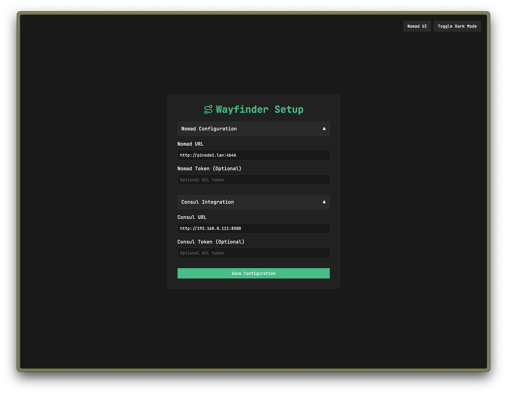
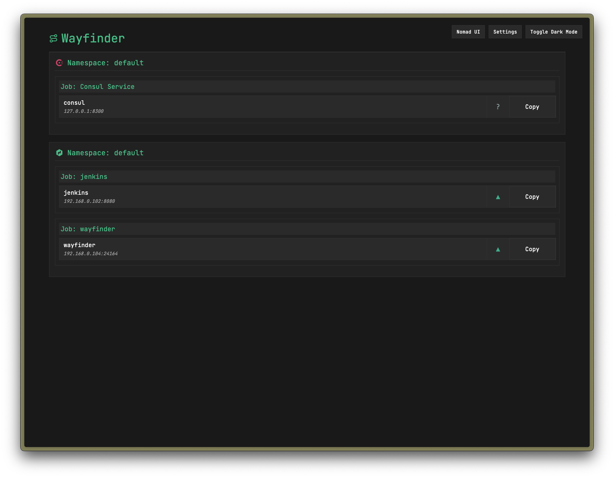

#  Wayfinder

Wayfinder is a lightweight service discovery and navigation tool designed for homelab environments running HashiCorp Nomad and Consul. It provides a clean, modern interface for discovering and accessing services across your personal infrastructure. While functional and reliable, it's intended for personal or small-scale deployments rather than production or enterprise environments.

## Features

- 🔍 Unified view of services from both Nomad and Consul
- 🏷️ Namespace-aware service organization
- 💡 Dark/Light mode support
- 🔒 Token-based authentication support
- ❤️ Real-time health status monitoring
- 🔄 Automatic service refresh
- 📋 One-click URL copying

## Screenshots

### Configuration Page


### Service Dashboard


## Prerequisites

- HashiCorp Nomad (required)
- HashiCorp Consul (optional)

## Deployment Options

### Quick Start with Docker

The easiest way to deploy Wayfinder is using the pre-built Docker image:

```bash
docker run -p 5000:5000 djschne/wayfinder:latest
```

### Deploy to Nomad

Deploy Wayfinder to your Nomad cluster using the provided job specification:

```bash
nomad job run wayfinder.nomad
```

The job specification includes:
- Pre-built Docker image (`djschne/wayfinder:latest`)
- Service registration with health checks
- Auto-configured network ports
- Resource allocation (CPU and Memory)

### Local Development

1. Clone the repository:
```bash
git clone https://github.com/yourusername/wayfinder.git
cd wayfinder
```

2. Create a virtual environment and install dependencies:
```bash
python -m venv venv
source venv/bin/activate  # On Windows: .\venv\Scripts\activate
pip install -r requirements.txt
```

3. Run the application:
```bash
python app.py
```

The application will be available at `http://localhost:5000`

## Configuration

### Nomad Integration

1. Access the Wayfinder UI
2. Enter your Nomad server URL (e.g., `http://nomad-server:4646`)
3. (Optional) Add your Nomad ACL token if authentication is enabled

### Consul Integration (Optional)

1. In the setup page, expand "Consul Integration"
2. Enter your Consul server URL (e.g., `http://consul-server:8500`)
3. (Optional) Add your Consul ACL token if authentication is enabled

## Security Considerations

- Wayfinder supports both Nomad and Consul ACL tokens
- Tokens are stored securely in the Flask session
- All service communication uses HTTPS when configured with TLS
- Service health data is updated every 30 seconds

## Directory Structure

```
wayfinder/
├── app.py              # Main application code
├── requirements.txt    # Python dependencies
├── Dockerfile         # Container build configuration
├── templates/
│   ├── index.html     # Main service dashboard
│   └── setup.html     # Configuration page
├── logos/             # Service logos
│   ├── consul-dark.svg
│   ├── consul-light.svg
│   ├── nomad-dark.svg
│   └── nomad-light.svg
├── wayfinder.nomad    # Nomad job specification
└── README.md          # This file
```

## Contributing

1. Fork the repository
2. Create a feature branch
3. Commit your changes
4. Push to the branch
5. Create a Pull Request

## License

This project is licensed under the MIT License - see the LICENSE file for details.